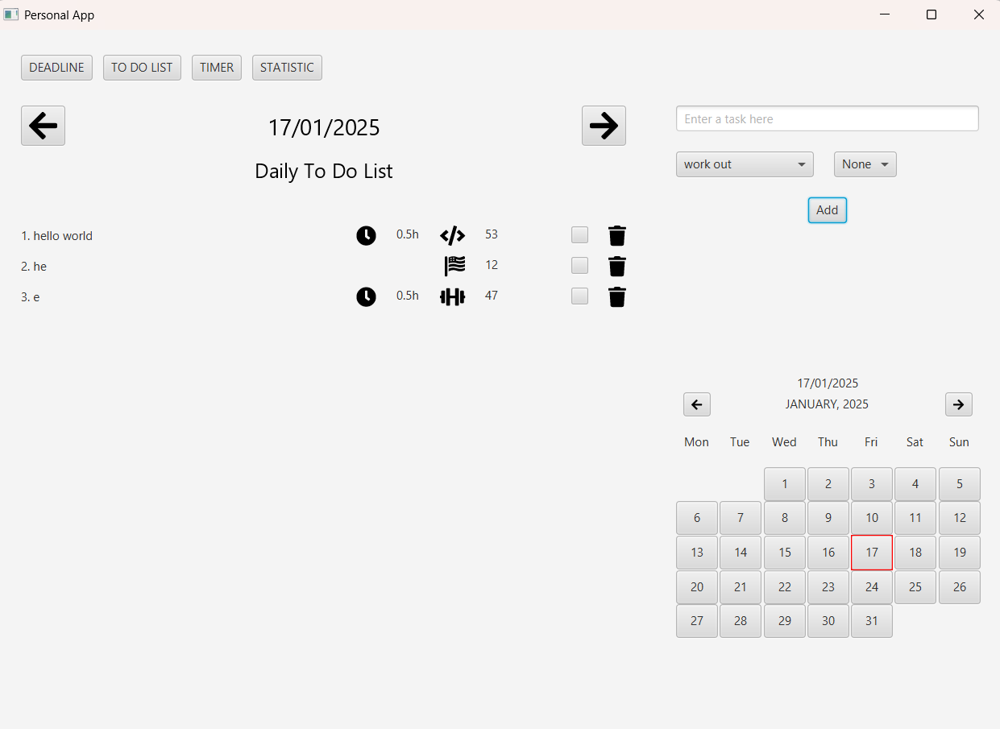

**Using JavaFX and MySQL**

**Set Up MySQL:**
- In the **hibernate.cnf.xml** file, change the username and password to match yours
- import database using folder **sql**

**Screenshots:** 

**- Deadline screen:**

  

**- To-do-list screen:**

  

**- Timer screen:**

  

**- Statistics screen:**

  
